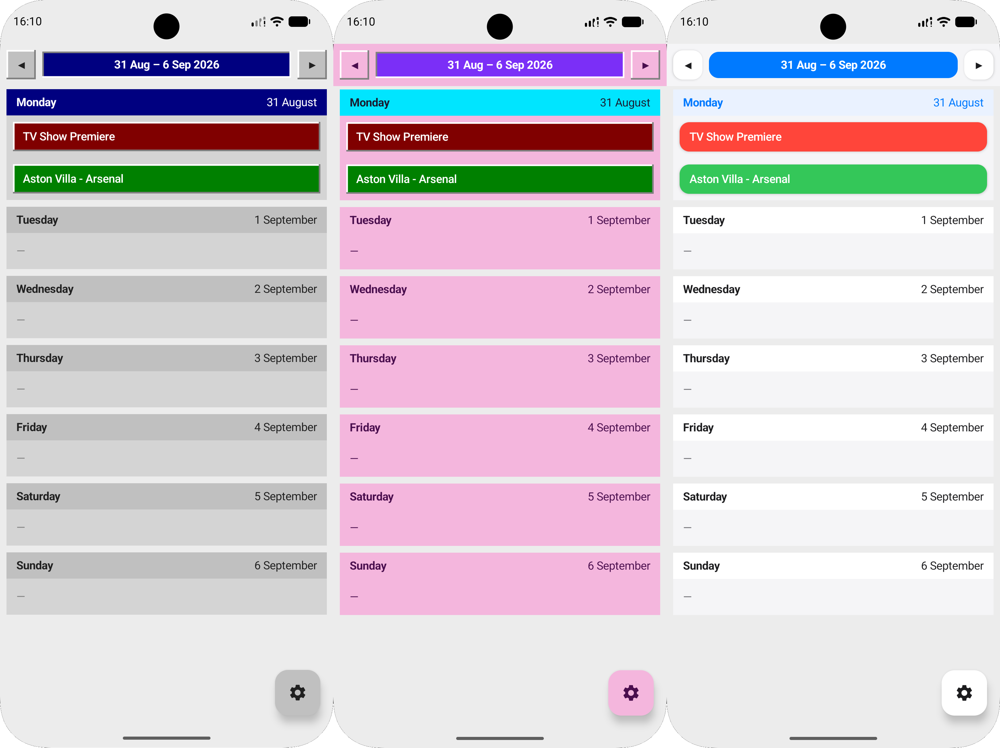

# Stapik Calendar (Android)

A read-only mobile companion to [Stapik Calendar](https://github.com/Stapik-Group/stapik-calendar), the desktop calendar app. Written in Kotlin with Jetpack Compose, styled after the same retro old-school aesthetic as the desktop version.



## Features

- **Weekly view** – swipe horizontally between weeks, each day shown as a full-width row for easy reading on a phone screen
- **Today at a glance** – the current day is highlighted when you open the app
- **Cloud sync (read-only)** – fetches calendar entries from the Stapik Cloud compatible self-hosted API
- **Offline cache** – automatically caches the last retrieved calendar version so you can view entries without internet access
- **Home screen widget** – quick access to your upcoming schedule directly from your Android home screen
- **Event notifications** – simple notification system to alert you about upcoming entries
- **Themes & entry colors** – customizable UI themes and rendering of custom event colors (classic, classic pink and modern theme)
- **Clickable links** – URLs within calendar entry descriptions are now interactive
- **Pull-to-refresh** – drag down to fetch the latest data on demand
- **Encrypted connection config** – server URL and API key are encrypted with a key held in the Android Keystore before being stored on device
- **Multilingual UI** – Polish, English and German, following the phone's system language
- **Retro aesthetic** – same raised-button, blue-navbar, grey-cell look as the desktop app

This app does not edit or delete entries – all editing happens in the desktop app. It only reads and displays whatever is currently in the cloud.

## Requirements

- Android 8.0 (API 26) or newer
- A running instance of the Stapik Cloud compatible sync API used by the desktop app (see [Stapik Calendar](https://github.com/Stapik-Group/stapik-calendar))

## Building

Requires [Android Studio](https://developer.android.com/studio) (Kotlin, Jetpack Compose).

```bash
git clone [https://github.com/Stapik-Group/stapik-calendar-android](https://github.com/Stapik-Group/stapik-calendar-android)

```

Open the project folder in Android Studio, let Gradle sync, then build/run via the green Run button or:

```bash
./gradlew assembleDebug

```

The resulting APK is at `app/build/outputs/apk/debug/app-debug.apk`.

## Installation

### Option 1 – install via Android Studio

Connect a device (USB or [wireless debugging](https://developer.android.com/tools/wireless-debugging)) or start an emulator, then hit Run in Android Studio.

### Option 2 – install a built APK manually

```bash
adb install app/build/outputs/apk/debug/app-debug.apk

```

Or transfer the APK to the device and open it directly (requires allowing installs from the source you used).

## Cloud Sync

On first launch, open the settings menu (gear icon, bottom right) – **Connect**, and enter the same server URL and API key configured on the desktop app (**File – Connect** there).

The app fetches `calendar.json` from the server on startup, whenever you return to the calendar after connecting, and whenever you pull to refresh. The sync API is fully compatible with **Stapik Cloud**.

Since this app is read-only, there's no write conflict to worry about on the mobile side – all conflict resolution (last-write-wins by timestamp) happens between desktop instances, as described in the [desktop app's README](https://github.com/Stapik-Group/stapik-calendar#cloud-sync).