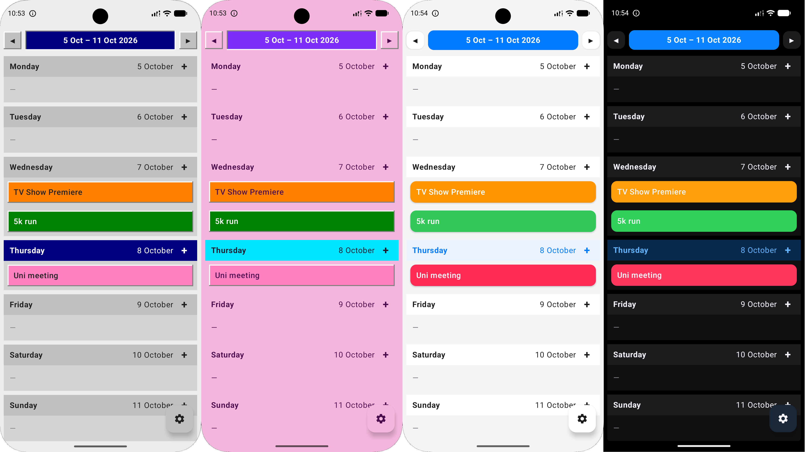

# Stapik Calendar (Android)

A mobile companion to [Stapik Calendar](https://github.com/Stapik-Group/stapik-calendar), the desktop calendar app. View your schedule, work fully offline, and – with a read-write API key – add and edit entries that sync back to the cloud. Written in Kotlin with Jetpack Compose, styled after the same retro old-school aesthetic as the desktop version.



## Features

- **Weekly view** – swipe horizontally between weeks, each day shown as a full-width row for easy reading on a phone screen
- **Today at a glance** – the current day is highlighted when you open the app
- **Cloud sync** – fetches calendar entries from the Stapik Cloud compatible self-hosted API; with a **read-write** key your changes are sent back, with a **read-only** key the app stays read-only
- **Add and edit entries** – tap **+** on a day to add an entry, tap an entry to change its name, link, date and color, or to delete it
- **Local mode** – works without any server: entries are stored on the device, and you can **disconnect** from the API at any time and keep working locally
- **Offline cache and pending changes** – the last retrieved calendar stays available offline, and changes made offline are sent to the server once it is reachable
- **Sync decision on (re)connect** – if local changes differ from the server, a dialog lets you keep the local version (and send it to the server) or download the server version
- **Home screen widget** – today's and tomorrow's entries in their colors, refreshed in the background every 3 hours; tapping it opens the app
- **Event notifications** – reminders about entries happening today or tomorrow, checked in the background at 8:00, 11:00, 14:00, 17:00 and 20:00 (even when the app is closed, restored after a reboot); each entry is notified only once
- **Themes & entry colors** – classic, classic pink, modern and dark themes, and the full entry color palette (red, orange, yellow, green, teal, blue, purple, pink, brown, gray)
- **Clickable links** – with a read-only key, tapping an entry that has a link opens it; when editing is available the link is opened from the entry editor
- **Pull-to-refresh** – drag down to fetch the latest data on demand
- **Encrypted connection config** – server URL and API key are encrypted with a key held in the Android Keystore before being stored on device
- **Multilingual UI** – Polish, English and German, following the phone's system language
- **Retro aesthetic** – same raised-button, blue-navbar, grey-cell look as the desktop app

## Requirements

- Android 8.0 (API 26) or newer
- A running instance of the Stapik Cloud compatible sync API used by the desktop app (see [Stapik Calendar](https://github.com/Stapik-Group/stapik-calendar))

## Building

Requires [Android Studio](https://developer.android.com/studio) (Kotlin, Jetpack Compose).

```bash
git clone https://github.com/Stapik-Group/stapik-calendar-android

```

Open the project folder in Android Studio, let Gradle sync, then build/run via the green Run button or:

```bash
./gradlew assembleDebug

```

The resulting APK is at `app/build/outputs/apk/debug/app-debug.apk`.

## Installation

### Option 1 – install via Android Studio

Connect a device (USB or [wireless debugging](https://developer.android.com/tools/wireless-debugging)) or start an emulator, then hit Run in Android Studio.

### Option 2 – install a built APK manually

```bash
adb install app/build/outputs/apk/debug/app-debug.apk

```

Or transfer the APK to the device and open it directly (requires allowing installs from the source you used).

## Cloud Sync

The app works out of the box in local mode. To sync, open the settings menu (gear icon, bottom right) – **Connect**, and enter the same server URL and API key configured on the desktop app (**File – Connect** there).

The app fetches `calendar.json` from the server on startup, whenever you return to the calendar after connecting, whenever you pull to refresh, and periodically in the background (widget and notification checks). After every edit it sends the calendar back to the server.

### Key permissions

- **Read-only key** – the app only displays the calendar; there is no **+** button and entries cannot be edited
- **Read-write key** – you can add, edit and delete entries, and changes are sent to the server after every edit (queued while offline)

### Local mode and disconnecting

Without a connection, entries are stored only on the device and can be edited freely. The **Connect** screen has a **Disconnect** button that removes the saved server URL and API key and switches the app to local mode; entries stay on the device.

### Resolving differences

When you connect (or reconnect) and the device has local changes that are not on the server – or the server changed in the meantime – a dialog asks what to do:

- **Keep local and send to server** – local entries are uploaded with the current timestamp so they win over what is in the cloud
- **Use server version** – the server copy overwrites local changes

With a read-only key only the server version can be used, since local changes cannot be sent.

Writes follow last-write-wins by timestamp, the same as between desktop instances, as described in the [desktop app's README](https://github.com/Stapik-Group/stapik-calendar#cloud-sync).
